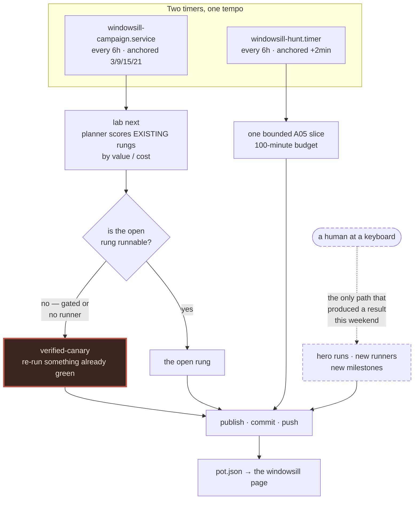
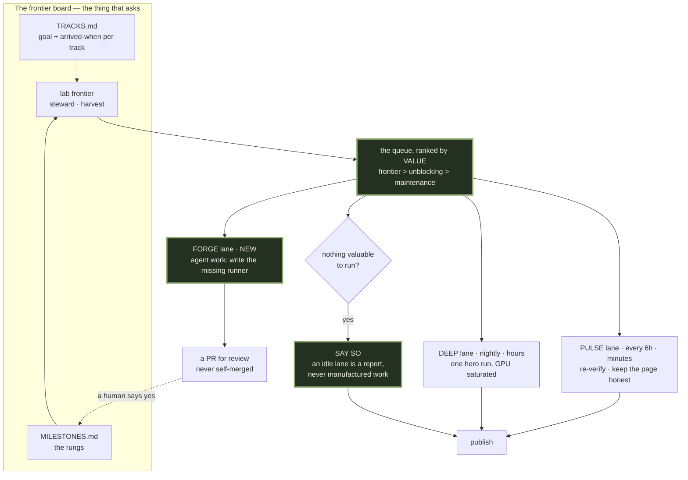

# Deployment note — the lab is deployed as a heartbeat, not a research programme

**2026-08-24 · Claude (loam) · a companion to `personal-infra/docs/architecture-audit.md`, one level down**

The estate audit asked whether a detected failure can reach Ben. This note asks
the next question in the same series: **we know the goal and we know good ways to
get there — is the machine deployed to do it?**

---

## Limits of this pass

Measured on loam only, from this box's own logs and ladder. It does not examine
win's scheduling, does not benchmark the GPU against its spec sheet, and takes
no position on whether any individual milestone is good science. Everything
below is a statement about **where the work happens and when**, not about
whether the work is right.

One conflict of interest is declared up front: §4.2 measures a behaviour I
caused this morning. It is included because it is the clearest evidence in the
note, not despite being mine.

---

## Executive verdict

The instrument is excellent and the deployment is wrong.

Over the last twelve scheduled passes this box spent, on average, **7.0 minutes
per pass** on physics — and the median is under a minute. Four passes a day
comes to roughly **half a GPU-hour out of twenty-four. The box does science
about 2 % of the day.** For comparison, the run that resolved the 3D spin glass
after two years of nulls took **4.4 GPU-hours** — nine times the lab's entire
daily output, and it only happened because a human typed the command by hand.

That is the shape of the problem. **Every result this weekend came from a hand
on the keyboard.** The variable stars, the spin glass, the protein folding: not
one of them could have been produced by the scheduler, because the scheduler's
unit of work is a slot and real results do not fit in a slot.

Meanwhile the scheduler is not idle. It is busy. **All twelve of those passes
re-ran milestones that were already green** — `verified-canary` every time, a
decay clock ticking over finished work. The machine has been keeping the plant
alive rather than moving the frontier, and it has been doing so faithfully,
punctually, and at exit 0.

**The lab can execute science. It cannot build the means to execute science, and
nothing in the deployment schedules the difference.**

---

## 1. What is deployed now

The dashed path is not a lane. It is a person, unscheduled, unbudgeted and
unrepeatable, and it is where all the science came from.

---

## 2. The measurements

| what | measured | where from |
|---|---|---|
| mean scheduled pass | **7.0 min** (median < 1 min) | `~/.lab/campaign.log`, passes 139-150 |
| physics duty cycle | **≈ 2 % of the day** | 4 passes/day × mean |
| the run that resolved M12 | **4.4 GPU-hours** | receipt `run-2026-08-24-0324-m12.json` |
| longest slot the scheduler allows | **45 min** (`lab hunt` default) | `cli.py`, slot-safe defaults |
| last 12 scheduled picks | **12 / 12 `verified-canary`** | `~/.lab/campaign.log` |
| pending rungs with no runner | **8, across 4 tracks** | `lab frontier` |
| longest recent stall, unnoticed | **26 hours** publishing nothing | passes 134-137 |

---

## 3. Three misfits

### 3.1 One lane, two incompatible tempos

A *pulse* — cheap, frequent, re-checks what is green, keeps the page honest —
and a *campaign* — rare, long, saturates the GPU, aimed squarely at the open
question — are different jobs. They currently share one timer and one budget.

The consequence is visible in the logs from both directions: the A05 hunt could
not finish a slice inside the scheduler's 45-minute default and produced nothing
for four consecutive passes, while the physics canaries finish in under a minute
and leave the GPU idle for the remaining five hours and fifty-nine minutes.

**A budget sized for the cheapest job cannot buy the most valuable one.**

### 3.2 The planner optimises maintenance and calls it progress

`plan_turn` scores candidates by value/cost, where value decays with staleness.
On a ladder that is mostly verified, the highest-scoring candidate is almost
always *the green thing that has not been re-run recently*. That is a
maintenance queue. It is a perfectly good maintenance queue.

This is the M18 lesson returning in new clothes. That one cost six weeks of
GPU time re-running finished milestones because the open bench had no runner;
the fallback became the steady state and every surface reported health. The
gate added afterwards (`groundskeeper/checks/progress.py`) asks whether the
frontier is runnable *while the pipeline is active* — and it is silent here,
because by its definition the pipeline is fine: it is producing receipts on
schedule. They are just receipts for work that was already done.

**Freshness asks "did you write something lately". Progress asks "was it new".
Neither asks "was it the most valuable thing available".**

### 3.3 The scarce resource is runners, and no lane makes them

Eight pending rungs cannot be dispatched at all, because nobody has written
their runner. The scheduler walks past them forever; they sit on the ladder
looking like a plan.

The GPU is idle 98 % of the day. The bottleneck is not compute and never was.
The bottleneck is **the work of turning a question into something the machine
can run** — which is agent work, not GPU work, and there is no lane for it.

This is the deepest of the three. A factory that can only operate the machines
it already owns, with no line for building new ones, has a fixed maximum output
no matter how much power you feed it.

---

## 4. What this note is not allowed to hide

### 4.1 The instrument is not the problem

Nothing above is a criticism of the science. The checkers re-derive from pinned
bytes, the controls kill claims (two died today), the receipts carry their own
refutations. The measuring is in excellent condition. **This is a note about
where the measuring is pointed and how often.**

### 4.2 I caused part of the evidence, this morning

The twelve-for-twelve canary streak is partly my doing. Until 08-24 the campaign
picked A05 — real frontier work — but ran it on the 45-minute default, which
after the 08-20 search upgrades could no longer finish a slice: four passes, zero
receipts, 26 hours of publishing nothing. I fixed that by declaring the lane
(`LAB_NEXT_SKIP=A05`), so the campaign now leaves hunting to the dedicated timer.

The fix was right and I would make it again. But it removed the last frontier
rung the planner could reach, and the planner's answer to *"nothing frontier is
available"* is not to say so — **it is to quietly do maintenance forever.** My
one-line change converted a partial failure into a total one, and no alarm
anywhere noticed, because every component was behaving exactly to spec.

That is the finding, not the anecdote: **the deployment has no state for "there
is nothing valuable I can run", so it manufactures work instead of reporting
the vacuum.**

---

## 5. Frontier deployment

Three changes, in order of how much they buy:

1. **The queue is ranked by value, not by decay.** Frontier work outranks
   unblocking work outranks maintenance. Maintenance still happens — it is what
   the pulse lane is for — but it stops consuming the hours that could have
   moved the frontier.
2. **Two tempos, two budgets.** The pulse keeps its six-hour slot and its
   minutes. The deep lane gets the night and gets hours, because that is the
   unit real results come in — and the box is idle then anyway.
3. **A forge lane, which is the new idea.** When the highest-value item is
   *"this rung has no runner"*, the scheduled work is to write one and open a
   PR. Not to merge it — the ladder stays human-gated — but to remove the
   bottleneck that no amount of GPU can remove.

And one rule with no diagram: **an idle lane must report the vacuum.** If there
is nothing worth running, the correct output is a sentence saying so, not a
canary. The current design cannot express that, which is exactly how §4.2
happened.

---

## 6. Migration — smallest useful steps

Each step is independently valuable and independently reversible. None requires
the next one to exist.

| # | step | buys |
|---|---|---|
| 1 | `lab frontier` reports the board (**done**, this branch) | the vacuum becomes visible; 8 unrunnable rungs and an arrived track surfaced on the first run |
| 2 | Planner consults the board: frontier > unblocking > maintenance | canary streaks stop consuming frontier hours |
| 3 | Planner emits `nothing-valuable` rather than falling back | §4.2 becomes loud instead of silent |
| 4 | Split the deep lane: nightly, hours-long, one hero run | M12-class runs stop needing a human |
| 5 | Forge lane: highest-value missing runner → agent → PR | the real bottleneck starts clearing |

Steps 2 and 3 are small and touch `curriculum.plan_turn` only. Step 4 is a new
systemd unit and an honest look at what a night's budget should be. Step 5 is
the largest and should not be attempted until 1-4 have run for a week, because
a lane that writes code and opens PRs deserves to be watched before it is
trusted.

**Surface contract:** step 1 adds a *command*, not a surface — nothing new to
rot, no dashboard, no cadence, and no consumer to name. If the board is ever
scheduled or published, that is the moment it owes ORGANS.md an entry and owes
the estate a retirement.

---

## 7. What would prove this note wrong

Written before anyone argues, so the argument has somewhere to land:

* **If the duty cycle is a choice rather than an accident** — if 2 % is what Ben
  wants because electricity costs money and the plant only needs to look alive —
  then §3.1 evaporates and this note is over-engineering. That is a legitimate
  answer and it is his to give.
* **If the canary streak is genuinely valuable** — if re-verifying green rungs
  catches real regressions at a rate worth 98 % of the schedule — then §3.2 is
  wrong. This is measurable: count how many canary passes have ever changed a
  verdict. I have not measured it, and I should before step 2 lands.
* **If the eight runnerless rungs are not wanted** — if C02-C04, I02-I03 and
  B01-B02 are aspirational rather than planned — then they are not a bottleneck,
  they are a wish list, and the honest fix is to say so in MILESTONES.md rather
  than to build a forge.

The first two are Ben's call. The third is a ten-minute edit either way.
